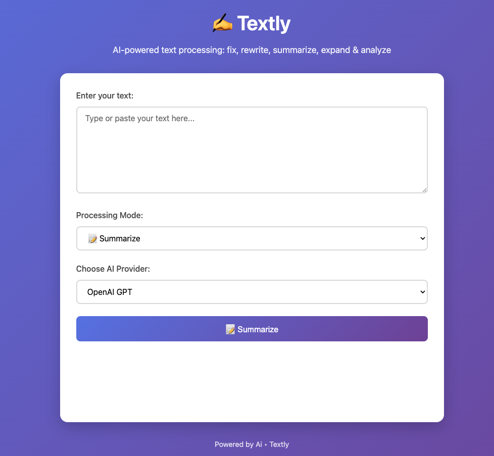
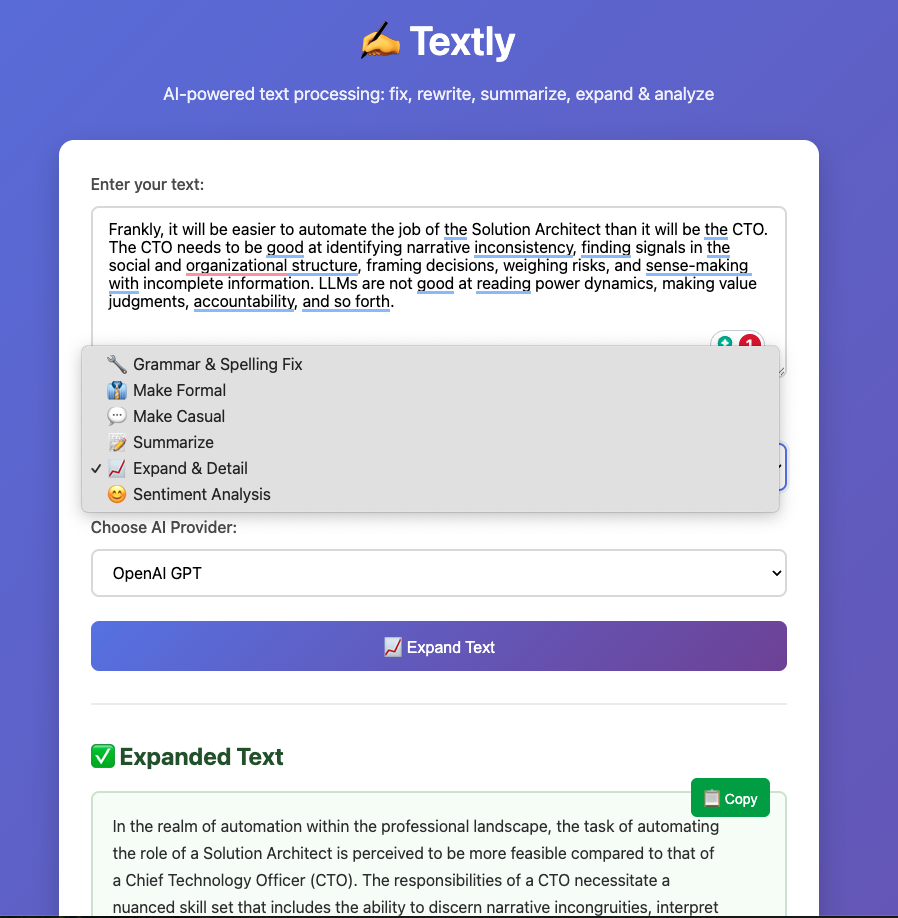

# Textly

AI-powered text processing that transforms your writing. A sleek Flask web application that can fix grammar, rewrite tone, summarize content, expand details, and analyze sentiment while preserving your intent. Supports both OpenAI GPT and Anthropic Claude.

## Screenshots



## Features

### 🚀 Text Processing Modes
- 🔧 **Grammar & Spelling Fix**: Correct errors while preserving your style
- 👔 **Make Formal**: Convert text to professional, business-appropriate tone
- 💬 **Make Casual**: Transform text to friendly, conversational style  
- 📝 **Summarize**: Condense long texts while maintaining key points
- 📈 **Expand & Detail**: Make text more comprehensive and professional
- 😊 **Sentiment Analysis**: Detect emotional tone (positive/negative/neutral)

### ⚡ Core Features
- 🔄 Switch between OpenAI GPT and Anthropic Claude
- 📱 Responsive web interface with intuitive controls
- 📋 Copy processed text to clipboard with one click
- 📊 Side-by-side comparison of original vs processed text
- ✨ Dynamic button labels that update based on selected mode
- 🎯 AI-powered processing that maintains context and meaning

## Setup

1. **Install Dependencies**
   ```bash
   pip install -r requirements.txt
   ```

2. **Configure API Keys**
   ```bash
   cp .env.example .env
   ```
   
   Edit `.env` file and add your API keys:
   - Get OpenAI API key from: https://platform.openai.com/api-keys
   - Get Anthropic API key from: https://console.anthropic.com/
   
   You need at least one API key for the app to work.

3. **Run the Application**
   ```bash
   python app.py
   ```
   
   The app will be available at: http://localhost:5000

## Usage

1. **Open the web interface** at http://localhost:5002
2. **Enter your text** in the textarea (type or paste)
3. **Select processing mode**:
   - 🔧 Grammar & Spelling Fix - Fix errors while preserving style
   - 👔 Make Formal - Convert to professional tone
   - 💬 Make Casual - Convert to conversational tone
   - 📝 Summarize - Create concise summary
   - 📈 Expand & Detail - Add depth and professionalism
   - 😊 Sentiment Analysis - Analyze emotional tone
4. **Choose AI provider** (OpenAI GPT or Anthropic Claude)
5. **Click the process button** (label updates based on selected mode)
6. **Review results** with side-by-side comparison
7. **Copy processed text** to clipboard for use elsewhere

## Project Structure

```
textly/
├── app.py                  # Main Flask application
├── ai_service.py          # AI service layer (OpenAI/Claude)
├── requirements.txt       # Python dependencies
├── .env                   # Environment variables
├── templates/
│   └── index.html        # Main web interface
└── static/
    └── css/
        └── style.css     # Styles and responsive design
```

## Health Check

Visit `/health` endpoint to check the status and available AI providers.

## Notes

- The app preserves the original tone and writing style
- Only grammar and spelling errors are corrected
- Both AI providers use low temperature (0.1) for consistent results
- Responsive design works on mobile and desktop